```{r setup, include=FALSE}
knitr::opts_chunk$set(echo = FALSE)
```

# 1.0 Critiques on the original design

This is the original design to illustrate Singapore's Merchandise Trade with its Top Six Trading Countries from 2019 to 2020
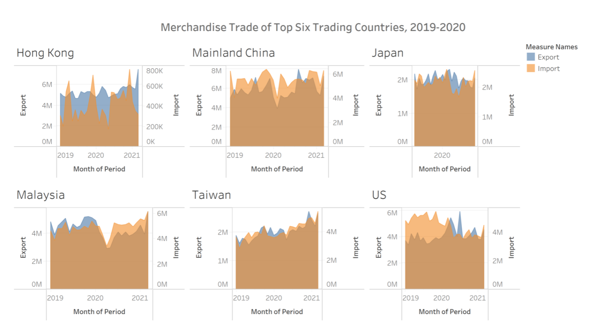  

### 1.1 Clarity

No |Critiques          |Proposed Solution   |
---|-------------------|--------------------|
1  | **Title can be more informative** - The title states what is the data showing, but it did not states what is the data is trying to portray | Come out with a short description on what should the reader's be expecting or gaining from the chart |
2  | **Inconsistent data used** - Japan only shows Year 2020 data, whereas the other countries show data from Year 2019 to end of Year 2020 | Data should be consistent throughout all countries for a fair comparison|
3  |**Using wrong type of chart** - Area line chart is best used when there is at least 1 variable that represent a summation value| Since 'Import' and Export' are independent variables, I would recommend using line chart if we want to understand the trends.

### 1.2 Aesthetics 
No |Critiques          |Proposed Solution   |
---|-------------------|--------------------|
1  | **No focus area** - There is no annotation or special colored data to indicate point of interest | Highlight certain data to capture reader's attention |
2  | **X axis markers** - X-axis title labeled Month of Period but the markers are only showing years | Shows the markers for months if the axis labeled months |
3  | **Transparency of area chart** - The opacity of the overlapping area is not prominent for both data to be seen clearly | Increase the transparency of 'Import' data |

# 2.0. Alternative Design
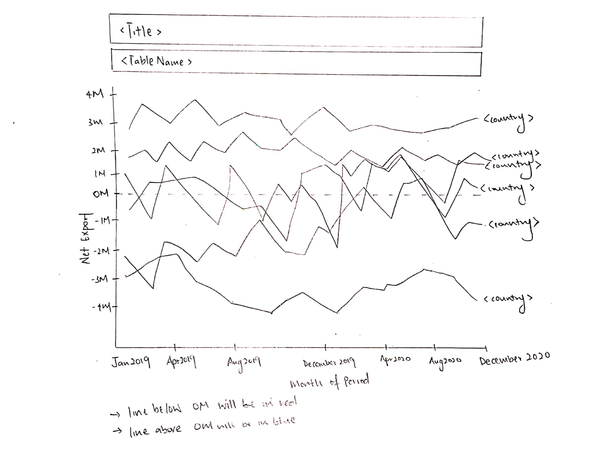  

### 2.1. Advantages of proposed design
#### 2.1.1 Clarity
i) Title tells a better story of what is to be expected from the graph and subtitle is used to annotate the overall chart.
ii) Instead of raw import and export data, this graph uses of Net Export formula (Export - Import) to illustrate the impact of Import and Export trades.
iii) Added units to x axis label to indicate the data is a monetary value.


#### 2.1.2 Aesthetics
i) Aesthetically, a simple line chart shows a better trends between the 6 countries.
ii) Color coordinated, with red indicating negative figures (Trade Deficit) and blue indicating positive figures (Trade Surplus).
iii) Annotation is used to highlight key points.
iv) Each line is accompanied with a country label instead of showing it as a separate legend.
v) Y axis is not divided into 6 segments, trends can be spotted with the level of granularity for the time period

# 3.0. Proposed Data Visualization
Raw data are available at [**DoSS**](https://www.singstat.gov.sg/find-data/search-by-theme/trade-and-investment/merchandise-trade/latest-data), under sub-section of Merchandise Trade by Region/Market.  
Actual Data Visualization can be viewed at Tableau Public 
[**here**](https://public.tableau.com/views/MerchandiseTrade_16223527793400/NetExport?:language=en-US&:display_count=n&:origin=viz_share_link)

# 4.0. Data Visualisation Step-by-Step

### 4.1. Data Preparation in Excel
1. Filter out the 6 countries (Hong Kong, Mainland China, Japan, Malaysia, Taiwan and United States) from **Import** Worksheet.
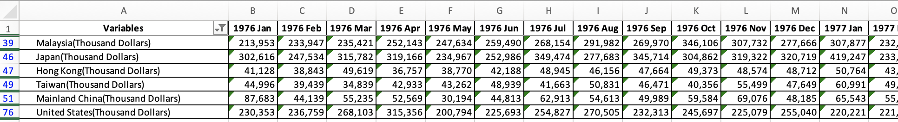{width=100%}
2. Retrieve data from Year 2019 Jan to Year 2020 Dec
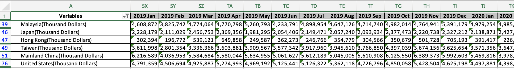{width=100%}
3. Repeat Step 1 and 2 again for **Export** worksheet

4. Consolidate the data into a new worksheet
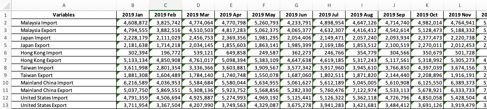{width=100%}

5. Transpose data
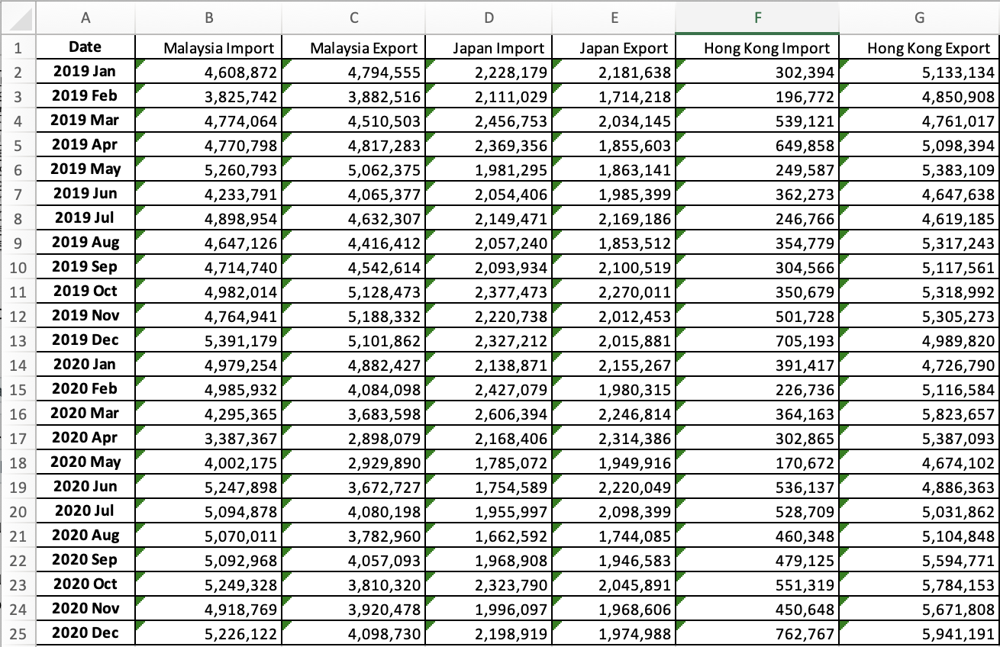{width=90%}
6. Reorganize data into a new worksheet (Data), consisting only 4 columns (Period, Country, Import and Export)
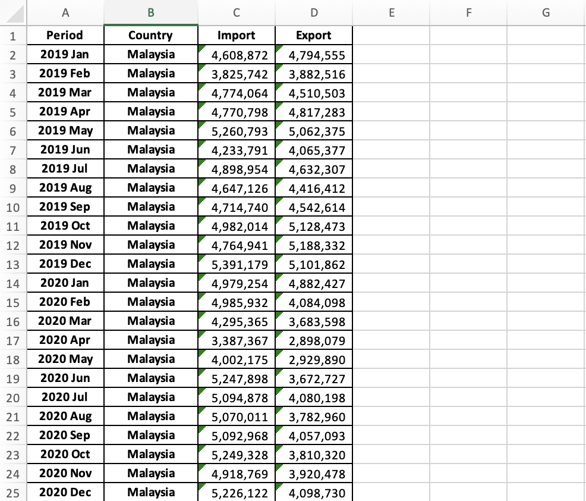{width=80%}

### 4.2. Data Visualization in Tableau

Import the Excel Sheet into Tableau and select "Data" worksheet as Data Source

1. Change Data Type  
Change 'Period' data type from String to Date  
Change 'Import' data type from String to Number (whole)  
Change 'Export' data type from String to Number (whole)  
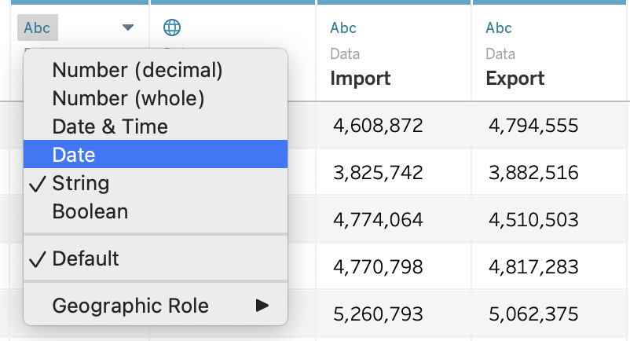{width=50%}

2. Create a calculate field to show Net Export  
Under Analysis > 'Create Calculated Field' **or** Right Click on the left panel > 'Create Calculated Field'  
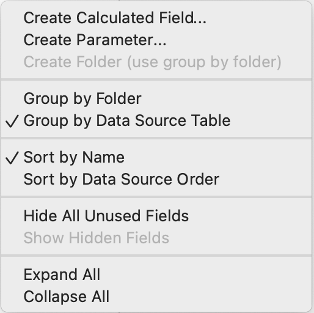{width=40%}  

3. Input Calculated Field **'Net Export (S$)'** Formula:  
SUM([Import]) - SUM([Export])  
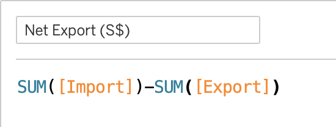{width=40%}  

4. Create a line chart to display Net Export from Year 2019 Jan to Year 2020 Dec  
Drag [Month(Period)] to Columns  
Drag [AGG(Net Export(S$))] to Rows  
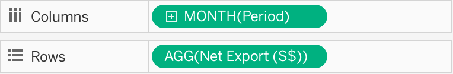{width=80%}

5. Separating Net Export data into Country level  
Drag [Country] into 'Details' and 'Label'  
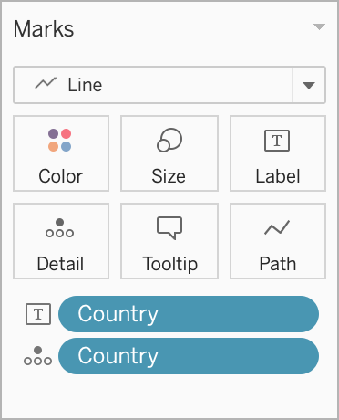{width=30%}  

5. Add colors to differentiate positive or negative net export  
Drag [AGG(Net Export(S$))] to 'Color' properties  
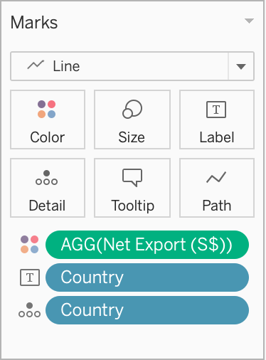{width=30%}  

6. Formatting Colors  
Once Step 5 is done, a color filter interface automatically appear in the right panel  
Click on the down arrow > Edit Colors...  
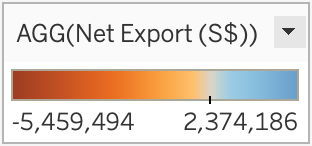{width=30%}  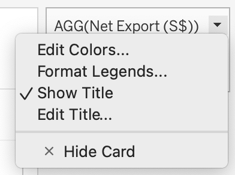{width=30%}  

* Under Palette > Select 'Red-Blue Diverging'
* Check 'Use Full Color Range'
* Click on Advance > Check Center and input 0 as the value  
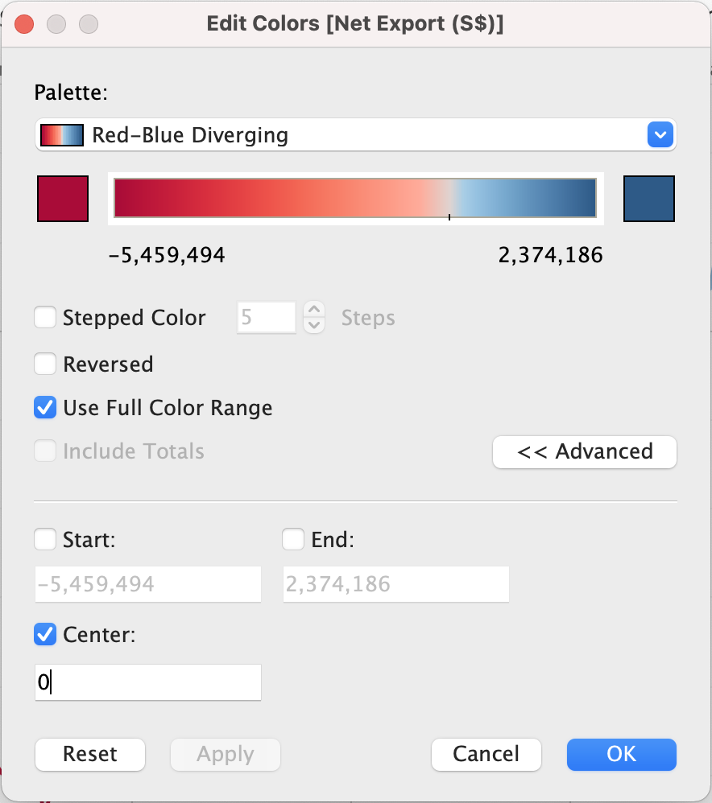{width=50%} 

7. Add Annotation  
Right click on an empty space in the chart > Annotate > Area  
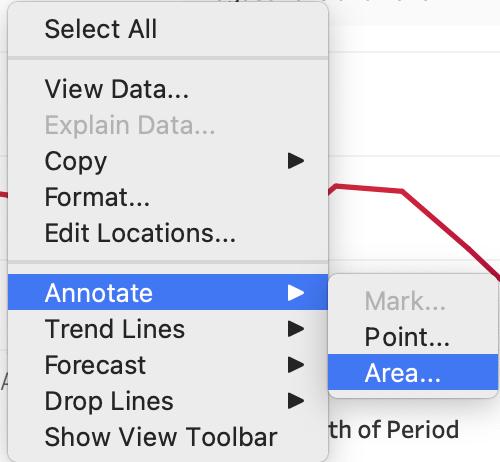{width=50%} 

# 5.0. Final Visualization

### 5.1. Snapshot of Graph
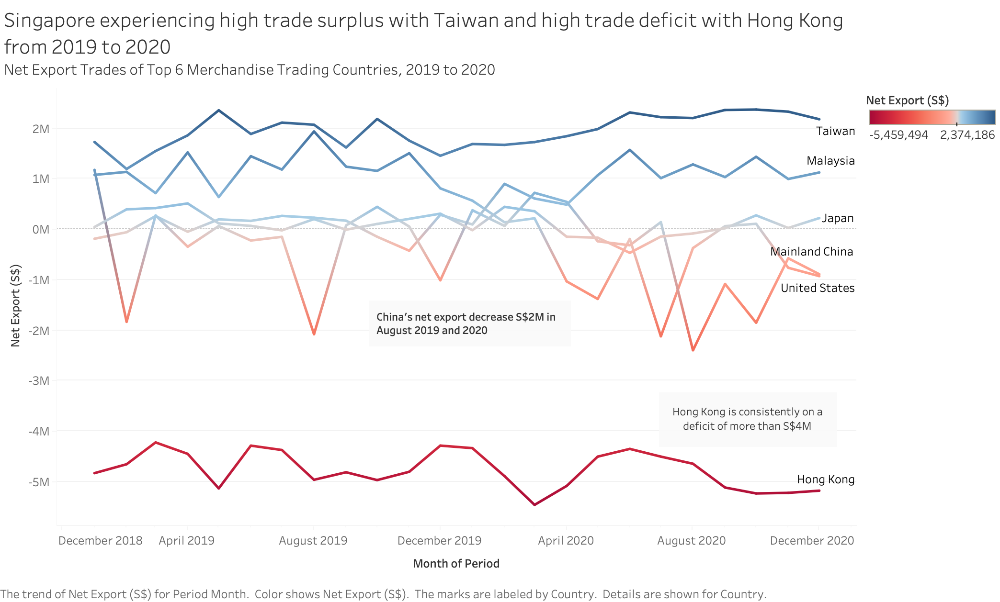

### 5.2. Major Observation and/or derived Insights

There are 2 extreme trading trends gathered between Taiwan and Hong Kong.  

Singapore trading behavior with Taiwan within this period can assumed to have contributed to Singapore economic growth due to trade surplus. Taiwan main import goods are oil/petroleum and natural gas, in which happen to be Singapore main export goods. Taiwan main export goods are electrical equipment and machinery, however, Singapore are importing it more from other countries such as China, Malaysia and United States. Therefore, Singapore is importing less from Taiwan, and exporting more to Taiwan, creating trade surplus.

On the other hand, between 2019 to 2020, Singapore is experiencing trade deficit with Hong Kong. Hong Kong's main exporting goods are electrical machinery, precious and minerals which Singapore needs. However, Hong Kong's main imports goods are also machinery equipment which is largely provided by China and Singapore only stands a small percentage of the total export trade. This result in inflow of import goods exceeded the outflow of export goods and this create trade deficit.

[**Observatory of Economic Complexity, 2019**](https://oec.world/en/profile/country/sgp)  
[**Singapore Import and Export data, 2019**](https://trendeconomy.com/data/h2/Singapore/TOTAL)