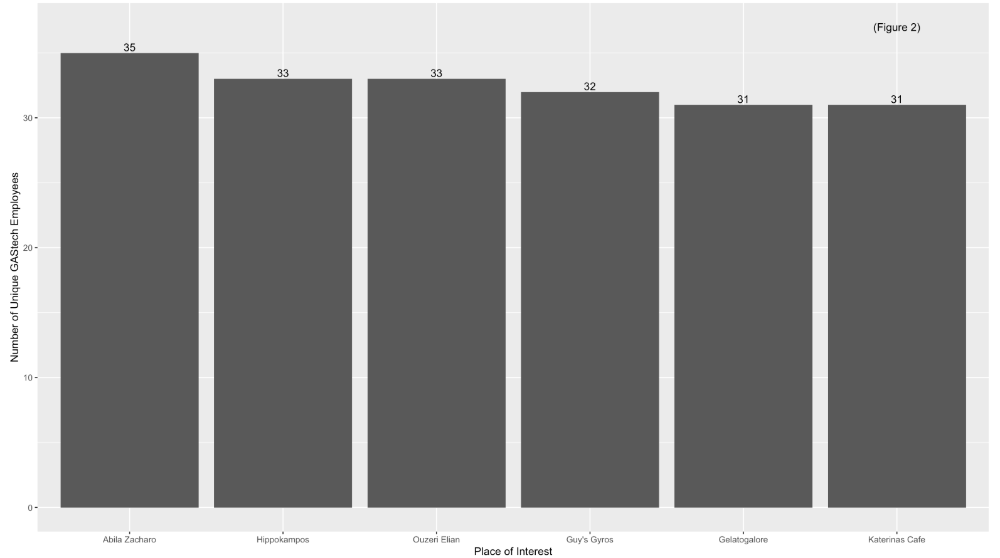
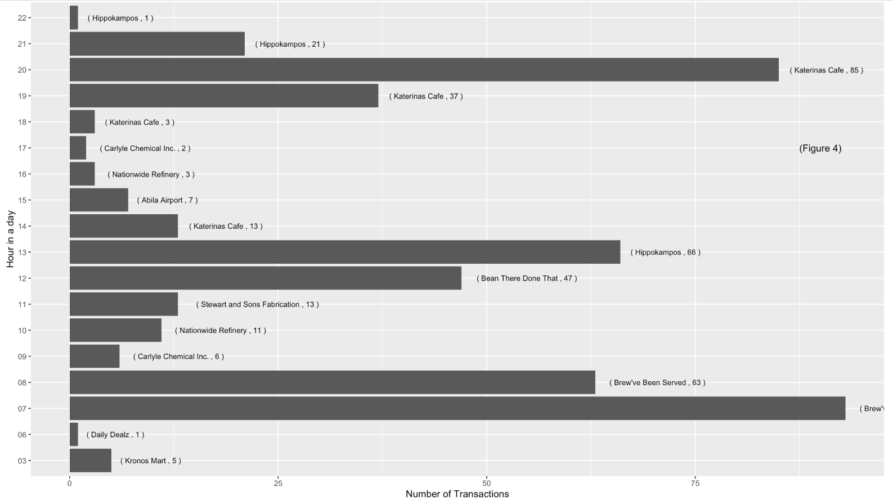
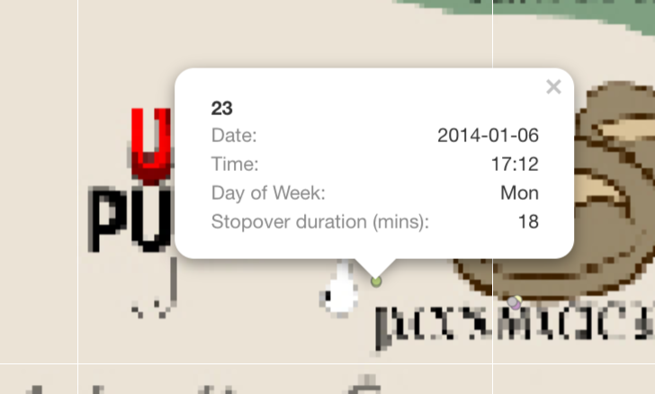
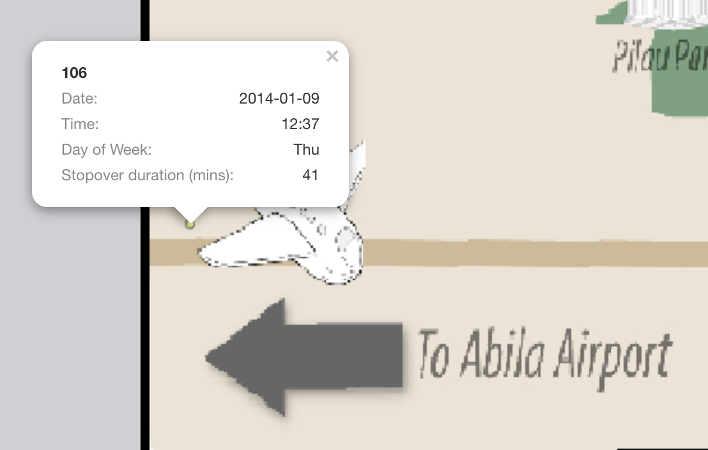
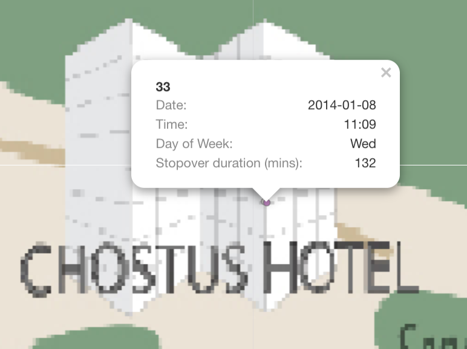
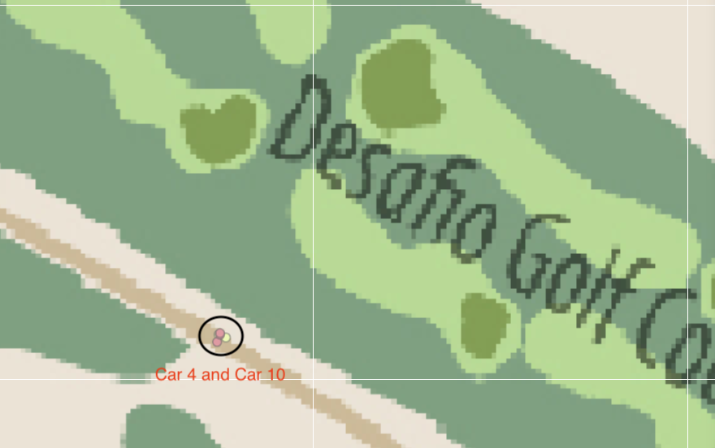
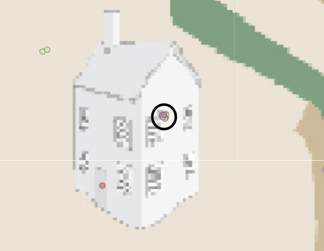
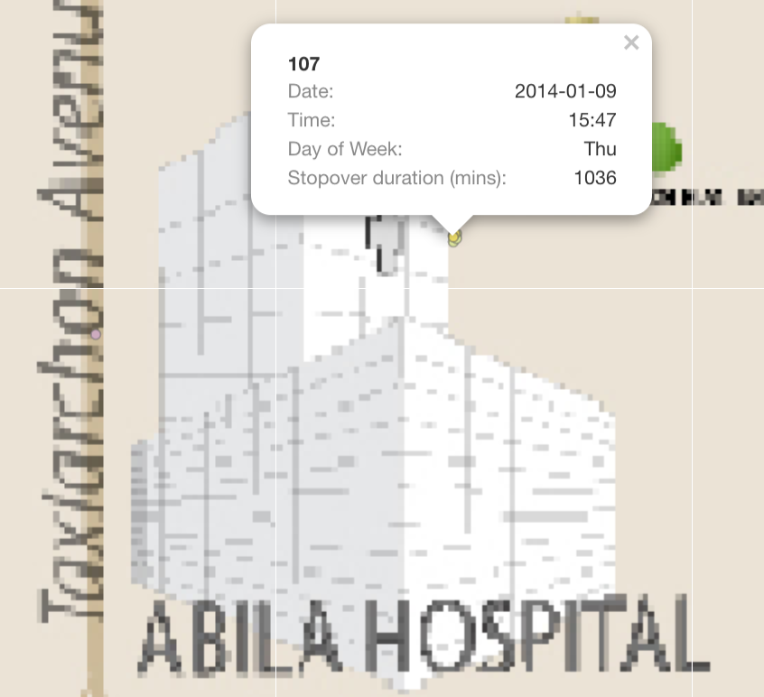
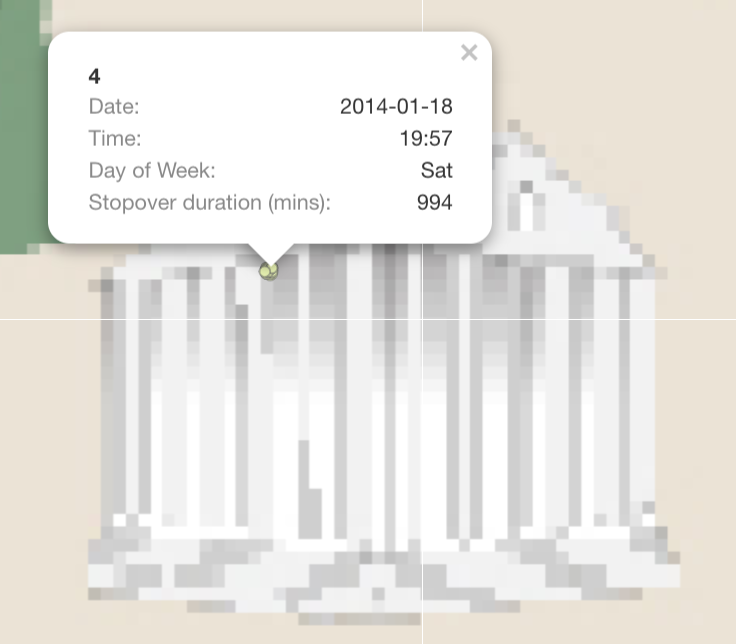
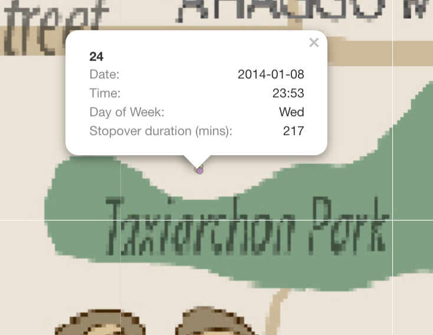

```{r setup, include=FALSE}
knitr::opts_chunk$set(echo = FALSE)
```

# 1. Overview
GAStech is a company that is located in a country island of Kronos and it has come to their attention that some of the employees had mysteriously went missing. Vehicles tracking data that was secretly installed in the company's cars and Kronos-Kares benefit card information are delivered to authorities for investigation. We are tasked to used these information to identity patterns, anomolies or suspicious information that can be used to assist the kidnapping of GAStech employees. 

# 2. Literature review of existing analysis performed
VAST challenges: Mini Case 2 was previously attempted back in 2014. There is a slight differences in the data given, such that credit card/Loyalty card records has Employees namein 2014 case and the revised mini case 2 in 2021 was not given any personal information in the card details. Therefore, it requires more cleaning and wrangling of data to infer the owners of the credits cards. 

There are numerous people who attempted the challenges in 2014 and some are awarded with special honorary segment. However, if we take a look at their reports at [VAST challenges Benchmark Repository](https://www.cs.umd.edu/hcil/varepository/VAST%20Challenge%202014/challenges/MC2%20-%20Patterns%20of%20Life%20Analysis/), most of their work are not reproducible.  Most of their designs and charts are either generated using JAVA or  SAS enterprise. Therefore, without any code guidance and additional knowledge of coding, it is a steep learning curve in order to reproduce what they presented in their papers.

One of the advantage of using R markdown to attempt this challenges is that I have gained certain knowledge in R programming from classes. R studio is a solid platform to reproduce work as code chunks can be written and store in the program and code chunk can be displayed with a simple commend such as echo=TRUE to reflect them when knitting the project. 

# 3. Extracting, wrangling and preparing the input data

### 3.1 Setting up environment
```{r, echo=TRUE}
packages = c('tidyverse', 'lubridate', 'dplyr', 'raster', 'clock', 'sf', 'tmap', 
             'plotly','ggplot2', 'mapview', 'rgdal','rgeos', 'tidyr')

for (p in packages) {
  if (!require(p, character.only = T)) {
    install.packages(p, repos = "http://cran.us.r-project.org")
  }
  library(p, character.only = T)
}
```

### 3.2 Importing Employee's Info and Car Assignment
```{r, echo = TRUE}
carAssignment <- read_csv("mc2/car-assignments.csv") 
carAssignment
```

### 3.3 Import Credit card and Loyalty card data
```{r, echo=TRUE}
ccData <- read_csv("MC2/cc_data.csv")
ccData$timestamp = date_time_parse(ccData$timestamp, zone = "", format = "%m/%d/%Y %H:%M")

ccData <- ccData %>%
  mutate(date = as.Date(ymd_hms(timestamp)), time = strftime(timestamp, "%H:%M"), hr = strftime(timestamp, "%H"))

loyaltyData <- read_csv("MC2/loyalty_data.csv") %>%
  mutate(date = as.Date(mdy(timestamp)))

ccLoyalty <- left_join(ccData, loyaltyData, by = c("date", "location", "price")) %>%
  dplyr::select(timestamp.x, date, time, location, price, last4ccnum, loyaltynum, hr) %>%
  rename(timestamp = timestamp.x) %>%
  group_by(last4ccnum)

ccLoyalty$weekday = wday(ccLoyalty$date, label = TRUE, abbr = TRUE) 
ccLoyalty$last4ccnum = as.character(ccLoyalty$last4ccnum)

ccLoyalty$location <- gsub("[\x92\xE2\x80\x99]", "", ccLoyalty$location)
ccLoyalty$location <- gsub("[\xfc\xbe\x8e\x96\x94\xbc]", "e", ccLoyalty$location)
ccLoyalty

```

### 3.4 Data cleaning
1. Convert special characters in Katerina's Cafe to "Katerinas Cafe"
2. Index similar credit card and loyalty card to 1 employee through grouping 

```{r, echo=TRUE}
ccLoyalty$location <- gsub("[\x92\xE2\x80\x99]", "", ccLoyalty$location)
ccLoyalty$location <- gsub("[\xfc\xbe\x8e\x96\x94\xbc]", "e", ccLoyalty$location)

ccLoyalty_person <- ccLoyalty %>% 
    group_by(last4ccnum) %>%
    distinct(loyaltynum) %>%
    arrange(last4ccnum) %>%
  filter(loyaltynum != 'NA')

ccLoyalty_person$ccPerson <- ccLoyalty_person %>% group_indices(last4ccnum)

lcard <- ccLoyalty %>% 
    group_by(loyaltynum) %>%
    distinct(last4ccnum) %>%
    arrange(loyaltynum)

new <- merge(ccLoyalty_person, lcard, by="loyaltynum") %>%
  arrange(ccPerson)

lookup <- new %>%
  select(ccPerson, last4ccnum.y) %>%
  arrange(ccPerson) %>%
  distinct(last4ccnum.y, .keep_all = TRUE)

xdata <- inner_join(new, lookup, by=c("ccPerson", "last4ccnum.y")) %>%
  arrange(ccPerson)

# reassign an id to be in running order
xdata$personId <- xdata %>% group_indices(ccPerson)
```

### 3.5 Mapping credit cards and loyalty card 
A single employee can carries multiple credit cards and loyalty cards 
Match the data created in 3.4 to the transaction data based on credit card to that each transaction is mapped to an id 

```{r, echo=TRUE}
ccLoyalty_merge <- left_join(ccLoyalty, xdata, by=c("last4ccnum"="last4ccnum.y")) %>%
  select(personId, timestamp, weekday, timestamp, date, time, location, price, last4ccnum, loyaltynum.x, hr) %>%
  arrange(personId) %>%
  distinct()
 
ccLoyalty_merge
```

### 3.6 Importing GPS 
1. Converting Timestamp to "Year-Month-Day Hour:Minutes" (YYYY-MM-DD HH:MM) format
2. Separate Timestamp into 2 new columns (Date & Time) 
3. Converting data type for id to factor  

```{r, echo=TRUE}
gps <- read_csv("MC2/gps.csv") %>%
  mutate(date = as.Date(mdy_hms(Timestamp)), time = format(mdy_hms(Timestamp), "%H:%M"))

gps$Timestamp <- date_time_parse(gps$Timestamp, zone = "", format = "%m/%d/%Y %H:%M:%S")  
gps$hr <- strftime(gps$Timestamp, "%H")
gps$id <- as_factor(gps$id)
gps$weekday <- wday(gps$date, label = TRUE, abbr = TRUE) 
gps
```

### 3.7 Car coordinates when vehicle stopped
I am eliminating coordinates that indicating that the car is moving
The GPS car coordinates are recorded every 1-5 secs. 
Therefore, if there is a GPS record difference of more than 5 min, which means the employee has driven the car to a destination.
Thus this eliminates possible traffic light stops and car moving in motion data.

For each employee:
1. I am getting the first and last car coordinate each day 
2. Getting places of interest through the day

```{r, echo=TRUE}
ts <- gps %>%
  group_by(id) %>%
    arrange(date, time, by_group=TRUE) %>%
      mutate(diff = round(c(difftime(tail(Timestamp, -1), head(Timestamp, -1), units = "mins"), 0)), 2) %>%
      mutate(count = 1:n(), FIRST = count == 1, LAST = count == max(count)) %>%
        filter(diff > 5 | FIRST == TRUE | LAST == TRUE) %>%
  arrange(id) %>%
  select(id, lat, long, date, time, diff, hr, weekday, Timestamp)
ts
```

### 3.8 Setting up the map of Abilas, Kronos 

```{r}
bgmap <- raster("MC2/Geospatial/MC2-tourist_modified.tif")

#tm_shape(bgmap) + # full data of the spatial file
#  tm_raster(bgmap, legend.show = FALSE)

Abila_st <- readOGR("MC2/Geospatial", layer = "Abila")
```

# 4. Insights and Observations

### Question 4.1 
Using just the credit and loyalty card data, identify the most popular locations, and when they are popular. What anomalies do you see? What corrections would you recommend to correct these anomalies?

```{r fig.width=7, fig.height=4, fig.show='hold'}
location_group <- ccLoyalty_merge %>%
  group_by(location) %>%
  summarise(n = n(), Total_Spending = sum(price), Average_Spending = mean(price), No_of_Emp = n_distinct(personId)) %>%
  arrange(desc(n)) %>%
  top_n(5)

location_group_Weekday <- ccLoyalty_merge %>%
  group_by(weekday, location) %>%
  summarise(n = n(), Total_Spending = sum(price), Average_Spending = mean(price),No_of_Emp = n_distinct(personId)) %>%
  slice(which.max(n))

location_group_hr <- ccLoyalty_merge %>%
  group_by(hr, location) %>%
  summarise(n = n(), Total_Spending = sum(price), Average_Spending = mean(price), No_of_Employees = n_distinct(personId)) %>%
  slice(which.max(n)) %>%
  arrange(hr)

## Plotting of graph

popLoc <- ggplot(location_group, aes(n, reorder(location, -n))) +
  geom_bar(stat='identity') +
  xlab("Number of transactions") +
  ylab("Place of Interest") + 
  geom_text(aes(label=n), position=position_dodge(width=0.9), hjust=-0.15) +
  annotate('text', x = 200, y = 'Gelatogalore', label = '(Figure 1)')

UniqEmp <- ggplot(location_group, aes(reorder(location, -No_of_Emp), No_of_Emp)) +
  geom_bar(stat='identity') +
  xlab("Place of Interest") +
  ylab("Number of Unique GAStech Employees") +
  geom_text(aes(label=No_of_Emp), position=position_dodge(width=0.9), vjust=-0.25) + 
  annotate('text', x = 'Katerinas Cafe', y = 37, label = '(Figure 2)')

popLocByWeek <- ggplot(location_group_Weekday, aes(weekday, n)) +
  geom_bar(stat='identity') +
  xlab("Day of Week") +
  ylab("Number of Transactions") +
  geom_text(aes(label=paste("(",location,",",n,")")), position=position_dodge(width=0.9), vjust=-0.25, size=3) +
  annotate('text', x = 'Sun', y = 35, label = '(Figure 3)')

popLocByHr <- ggplot(location_group_hr, aes(n, hr)) +
  geom_bar(stat='identity') +
  xlab("Number of Transactions") +
  ylab("Hour in a day") +
  geom_text(aes(label=paste("(",location,",",n,")")), position=position_dodge(width=0.9), hjust=-0.15, size=3) +
  annotate('text', x = 90, y = 13, label = '(Figure 4)')
```


Observation | Supporting Evidence
------------|--------
Figure 1 shows that "Katerina's Cafe" is identified as the popular location as it has the highest number of transaction made within these 2 weeks, followed by "Hippokampos" and "Guy's Gyros". | {width=150%}
Figure 2 shows that "Abila Zacharo" attracts more than 80% of GAStech employees who are entitled a company car. |{width=150%}
Figure 3 and 4 indicates that during Monday to Friday (Working day) and between 7am to 8am, the most frequented locations are Food & Beverage outlets, namely "Brew've Been Served" where employees go out for lunch or buy a cup of coffee for their breakfast and most of the employees head over "Katerina's Cafe" at night, probably for dinner. | {width=150%} {width=150%}
However, based on the credit card and loyalty card record, only 30 employees left at least 1 transaction trail. |
Assumptions was made while cleaning credit card and loyalty card transaction. 1 employee carries multiple credit cards and loyalty card.|


```{r, echo=TRUE}
ccLoyalty_merge$personId <- as_factor(ccLoyalty_merge$personId)
test <- ccLoyalty_merge
test$date <- as.Date(test$date)
test$time <- as.POSIXct(format(test$time, zone="", format = "%H:%M"), format = "%H:%M")

p <-ggplot(test, aes(date, time)) +
  geom_jitter(aes(group = personId, color = personId)) +
  scale_y_datetime(date_breaks = "1 hour", date_labels = "%H") +
  scale_x_date(date_breaks = "1 day", date_labels="%d")
  
fig <- ggplotly(p)
```


The figure above shows the transactions of all the GAStech employees across these 2 weeks. We can established a pattern of their purchases such as Morning breakfast (7am to 9am), Lunch time at 12pm, late lunch or breaks from 1pm to 3pm and dinner time from 7pm to 10pm. 


There are a few anomalies (outliers) such as the dots from 3am to 6am. Especially during 18 January 2014, 3 transactions are made within 30 mins of each other. 

### Question 4.2 
Add the vehicle data to your analysis of the credit and loyalty card data. How does your assessment of the anomalies in question 1 change based on this new data? What discrepancies between vehicle, credit, and loyalty card data do you find? Please limit your answer to 8 images and 500 words.


Each end point of a straight line in Figure X represent that an employee has stopped at a location for a long duration of more than 5 mins over 2 weeks. 
This shows some of the popular location such as "Brew've Been Served", "Katerina's Cafe" and "Hallowed Grounds"

### Question 4.3
Can you infer the owners of each credit card and loyalty card? What is your evidence? Where are there uncertainties in your method? Where are there uncertainties in the data? Please limit your answer to 8 images and 500 words.

Since we are aware of the popular areas from Question 4.1, these are the locations that is overcrowded with data points.
Therefore, the trick to identify the owners to the credit card and loyalty card is by narrowing down the scope to unpopular locations, such as "U-Pump", "Golf Course" and "Abila Airport".

For Example:
1. There are only 2 transaction made at U-Pump on 2014-01-06; one of them is at 1:18pm, the other is at 5:28pm. 
Based on the GPS locations on that day, Car 23 and Car 24 had made a stop at U-Pump at 5:12pm for 18 mins and at 12:35 for 47 mins respectively.

{width=100%}
{width=50%}{width=50%} 

2. The next location that I used to infer, is "Abila Airport" and I filtered out a single day "2014-01-09". 
There are a total of 5 GPS location record at "Abila Aiport" and 4 credit card transactions made. 
- 3 records of truck ID 104 at 10:51am (For 24 mins), 11:16am (For an hour), 1:09pm (For 2.7 hours)
- 1 record of truck ID 101 at 8:29am (For 58 mins)
- 1 record of truck ID 106 at 12:37pm (For 41 mins)

Using the above vehicles information, I can infer that:
- personId 8 in CC data is truck ID 106
- personId 15 in CC data is truck ID 101
- personId 41 in CC data is truck ID 104


{width=100%}
{width=50%}{width=50%} 

However, this method may creates loopholes such as if credit card is stolen and used by someone else, it will tend to mislead us that the employee made a purchase but in fact he/she didn't.
The data is missing information on employee personal details with the credit card or loyalty card data. Through data cleaning, we understand that each employee can have multiple credit card and multiple loyalty card, there are bound to be mislinked data. 

### Question 4.4
Given the data sources provided, identify potential informal or unofficial relationships among GASTech personnel. Provide evidence for these relationships. Please limit your response to 8 images and 500 words.

```{r}
by_date <- ts %>%
  filter(date == '2014-01-15')

by_date$date <- factor(as.Date(by_date$date))


gps_sf_path <- st_as_sf(by_date, coords = c("long", "lat"), crs = 4326)  %>%
            #group_by(id) %>%
            #summarize(Timestamp = mean(Timestamp),
            #             do_union=FALSE) %>%
            st_cast("POINT")

tm_shape(bgmap) + 
  tm_rgb(bgmap, r = 1, g = 2, b = 3, # setting red to band 1, green to band 2, blue to band 3
         alpha = NA,
         saturation = 1,
         interpolate = TRUE, 
         max.value = 255) +
  tmap_options(max.categories = 44) +
  #tm_shape(Abila_st) + 
  #  tm_lines() +
  tm_shape(gps_sf_path) +
    #tm_lines(col = "date")
    tm_dots(col ="id",
            popup.vars=c("Date:"="date", "Time:"="time", "Day of Week:"="weekday", "Stopover duration (mins):"="diff"))
```

Relationship | Supporting Evidence
------------ | --------------------
1. Car ID 7 and 33 seems to have a romantic relationship. On 8th and 14th, Car ID 7 and 33 checked into Chostus Hotel on a Wednesday brunch hour 11am for a minimum of 1hr 40 mins on both occasions.  | {width=100%}{width=100%}
2. Car 4 and Car 10 are Golf buddy. On 2 occasions, 12th and 19th, they stopped by Desafio Gold Course at 12:30pm, for 2.5 hours and 1pm, for 3 hours respectively. | {width=100%}
3. Engineering team has a after work gathering session on 10th at Car 2 house. Car ID 2,3,5,11,19,18,25,26 and 33 is there. | {width=100%}


### Question 4.5
Do you see evidence of suspicious activity? Identify 1- 10 locations where you believe the suspicious activity is occurring, and why Please limit your response to 10 images and 500 words.

Suspicious Activities | Support Evidence
--------------------- | ----------------
1. On 9th, Truck Driver 107 stop by Abila Hospital and GPS tracking states that he have stopover for at least 17 hours. | {width=100%}
2. Car 4 is often seen hanging around courtyard. He has more than 10 GPS records indicating he stop by for long period each time. | {width=100%}
3. I believe Car 17, 24, 33 has a certain relationship. They are always staying and leaving from the same location on multiple occasion, with a few mins apart from each other. However, there is no house icon on the maps that indicates it is a residential area. | {width=100%}
4. I believe Car ID 14 and 18 had the same behaviour as No.3. They always have stopover GPS records together on multiple occasions | {width=100%}
5. Car 24 stopped at Taxiarchon Park on 8th at 11:53pm and stayed for 3 hours. It is weird that someone will head over to a park in the middle of the night | {width=100%} 
